## 🚛 AI, Remembers You

### 🛠 개발 배경

<table align="center" border="0">
  <tr>
    <td align="center">
      
       
      <b>〈약 복용을 까먹거나 과 복용하는 사례〉</b>
    </td>
  <td align="center">
    
       
      <b>〈창문을 제대로 닫지 않아 침입 범죄 발생 통계〉</b>
    </td>
  </tr>
</table>

중앙치매센터(증가하는 초기 치매 환자 통계), 보건복지부(치매 시장 확장 전망) 통계와 약 오용 문제 사례 등의 조사를 통해, 저희는 일상 데이터를 기반으로 한 개인화 서비스의 중요성을 실감했습니다.
사용자가 리마인더와 알람 등으로 수동으로 기록해야 했던 기존의 치매 대상 서비스들의 번거로움과 한계를 극복하고자, **LLM 기반 문맥 인지 기술과 Vector DB(또는 RAG 기술)** 를 결합한 **AI 일상 기억 및 루틴 파악 시스템: ARU**을 개발했습니다. 실시간 일상 맥락 분석을 통해 사용자의 핵심 행동 패턴을 파악하고 장기 기억(Long-term Memory)화합니다. 그리고 이를 기반으로 맞춤형 루틴 추천 및 피드백을 제공하여 일상적 건망증 또는 초기 치매로 인한 일상생활 저하을 보조합니다. 부가적으로 사용자의 패턴에 맞지 않게 위치한 물체를 제자리로 옮겨주는 기능 또한 제공합니다.

### 📝 한 줄 요약
복약과 일상을 집 안의 AI가 대신 기억하고 알려주는, 건망증·초기 치매를 위한 온디바이스 홈 케어 서비스

---

## 📅 프로젝트 개요
- **프로젝트 명:** ARU (AI, Remembers U)
- **수행 기간:** 2026.06.03 ~ 2026.06.15
- **주요 기능**
  - **1:** LLM 기반 챗봇으로 음성 및 텍스트로 대화하며, 물건들의 위치, 사용자의 행동 정보를 확인 가능
  - **2:** 홈캠 영상을 온디바이스 엣지 AI로 실시간 검출하고, 멀티모달 LLM으로 텍스트화·RAG 저장하여 알맞은 정보 제공
  - **3:** 과거 데이터를 분석하여 자동으로 루틴을 추천하며, 밸소리와 진동을 포함한 알람 제공
  - **4:** 루틴의 목표 행동을 감지하면 알람을 울리지 않아 선택적 알람 제공
  - **5:** 사용자의 물건들을 로봇팔을 이용하여 지정된 위치로 정리함
  - **6:** 고령의 사용자에게 초점을 둔 UI/UX로 손쉬운 사용이 가능한 앱 제공

---

## 🎬 시연 영상
<table align="center">
  <tr>
    <td align="center"><b>ARU 애플리케이션 시연</b></td>
  </tr>
  <tr>
    <td>
      
    </td>
  </tr>
</table>

<table align="center">
  <tr>
    <td align="center"><b>ARU 로봇팔 시연</b></td>
  </tr>
  <tr>
    <td>
      <a href="https://youtu.be/66-pFlFDmbc?si=yLgezzZP7GBSh6kA">
        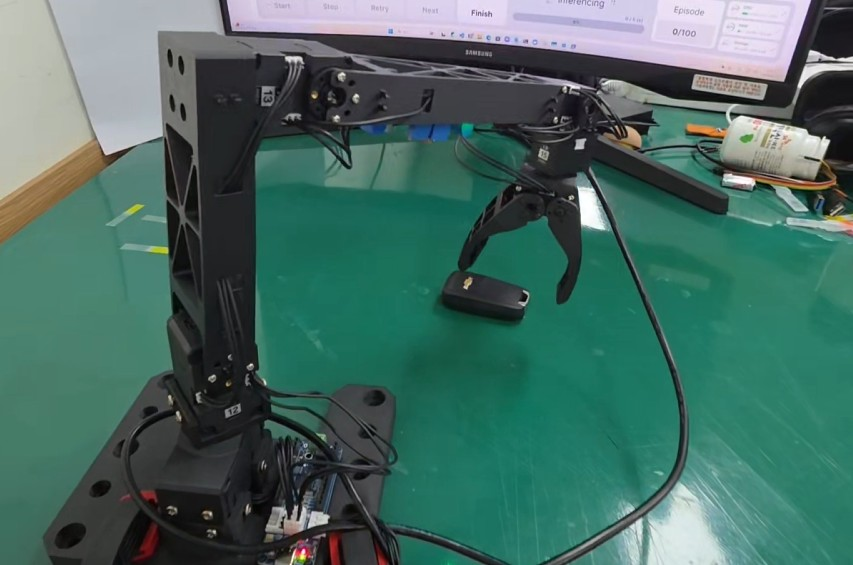
      </a>
    </td>
  </tr>
</table>

---

## 🛠 기술 스택 & 아키텍처

  

---

## 📱 안드로이드 애플리케이션 (ARU App)

ARU 앱은 고령자 및 초기 치매 환자도 쉽게 사용할 수 있도록 직관적인 UI/UX로 설계되었습니다. Kotlin과 Jetpack Compose를 기반으로 개발되었으며, MVVM 아키텍처를 적용하여 안정적인 성능을 제공합니다.

### 1. 홈 화면 및 사용 방법
앱의 진입점으로, 사용자가 앱의 주요 기능(기억 찾기, 영상 확인, 루틴 알람 등)을 쉽게 이해하고 바로 접근할 수 있도록 안내합니다.

  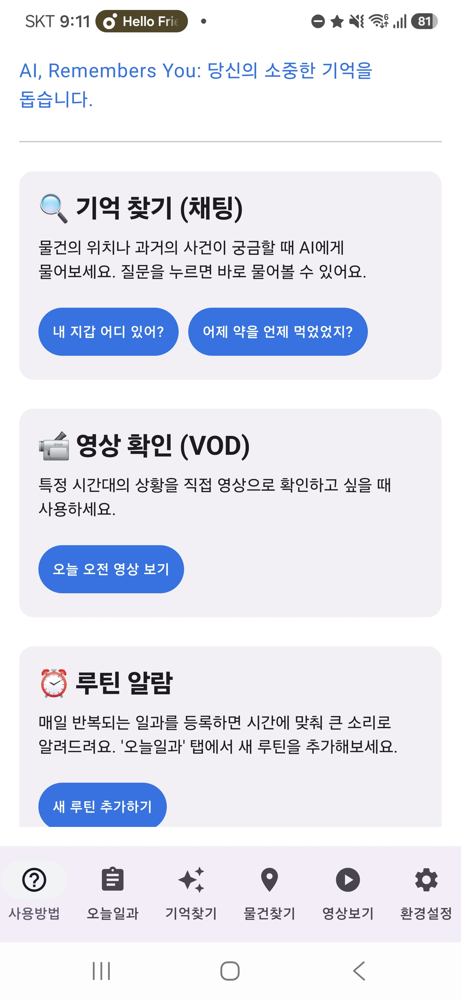

---

### 2. 기억찾기 (AI 챗봇)
LLM 및 RAG 기반으로 사용자의 문맥을 기억하여 대화형으로 정보를 제공합니다. 물건의 현재 위치를 이미지와 함께 찾아주거나, 특정 물건이 언제 누구에 의해 이동되었는지 과거의 타임라인을 추적하여 알려줍니다.
<table align="center">
  <tr>
    <td align="center"><b>현재 물건 위치 확인</b></td>
    <td align="center"><b>과거 이동 기록 (타임라인) 추적</b></td>
  </tr>
  <tr>
    <td>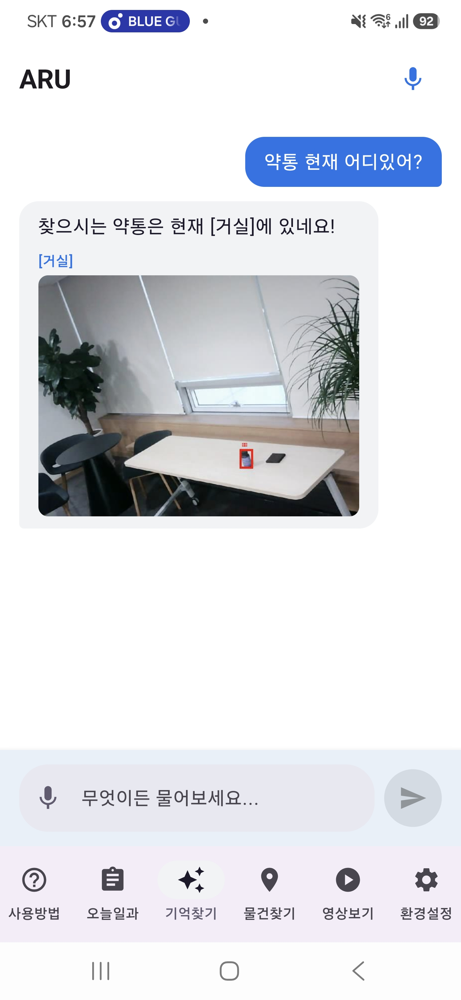</td>
    <td>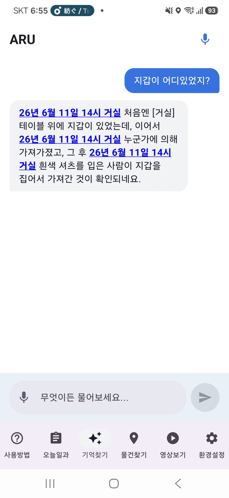</td>
  </tr>
</table>

---

### 3. 오늘일과 (맞춤형 루틴 및 알람)
사용자의 스케줄(약 복용, 창문 닫기 등)을 관리하고 지정된 시간에 큰 알람 소리와 진동으로 알려줍니다. 오프라인 상태에서도 동작하도록 SharedPreferences를 활용해 로컬에 데이터를 캐싱하며, AI가 사용자의 패턴을 분석해 새로운 루틴을 추천해 줍니다.
<table align="center">
  <tr>
    <td align="center"><b>루틴 목록 및 관리</b></td>
    <td align="center"><b>새로운 루틴 추천 (Push)</b></td>
    <td align="center"><b>강력한 루틴 알람 발생</b></td>
  </tr>
  <tr>
    <td>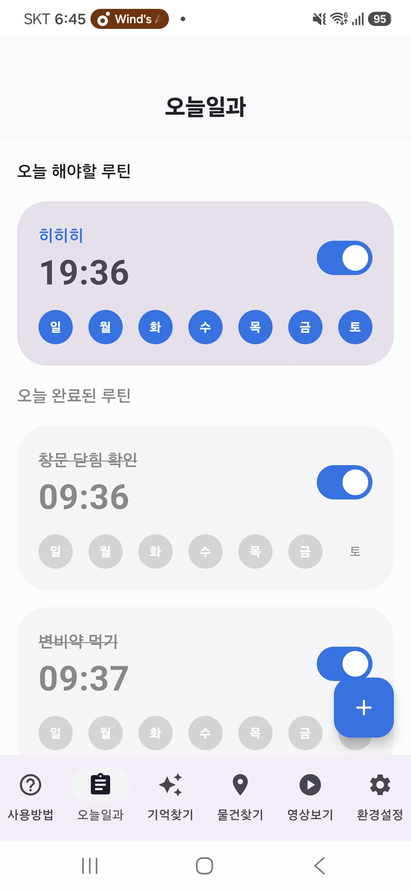</td>
    <td>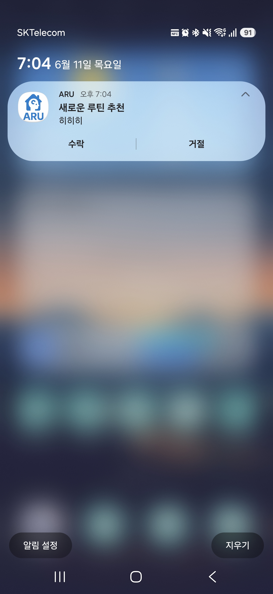</td>
    <td>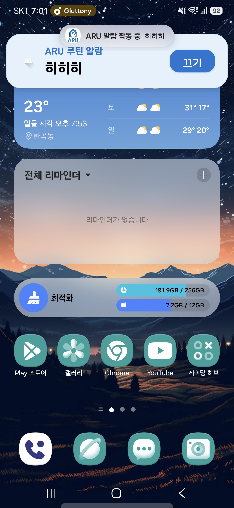</td>
  </tr>
  <tr>
    <td colspan="3" align="center">
      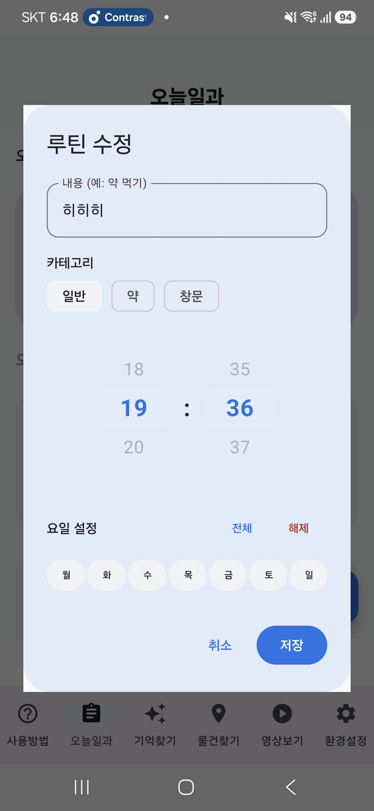
       <b>루틴 추가 및 수정 화면</b>
    </td>
  </tr>
</table>

---

### 4. 물건 현황 모니터링
엣지 디바이스와 통신하여 지갑, 약통, 열쇠, 리모컨 등 사용자가 자주 잃어버리는 핵심 물건들의 현재 상태와 위치(방 이름)를 실시간 그리드 형태로 한눈에 보여줍니다.

  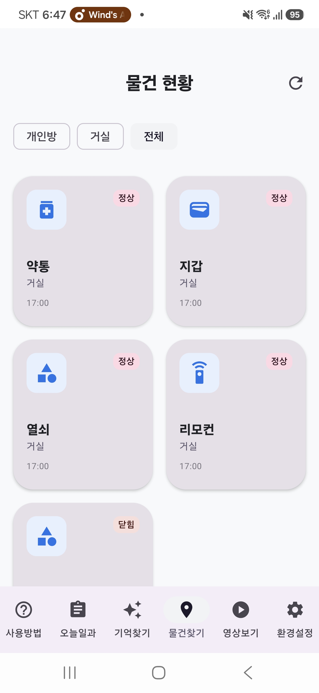

---

### 5. 영상보기 (VOD 및 실시간 LIVE)
집 안의 특정 카메라(Cam1, Cam2 등)를 선택하여 실시간 라이브 스트리밍을 확인하거나, 특정 날짜와 시간대로 필터링하여 과거에 녹화된 VOD 영상을 재생할 수 있습니다.
<table align="center">
  <tr>
    <td align="center"><b>실시간 LIVE 스트리밍</b></td>
    <td align="center"><b>과거 VOD 영상 확인</b></td>
  </tr>
  <tr>
    <td>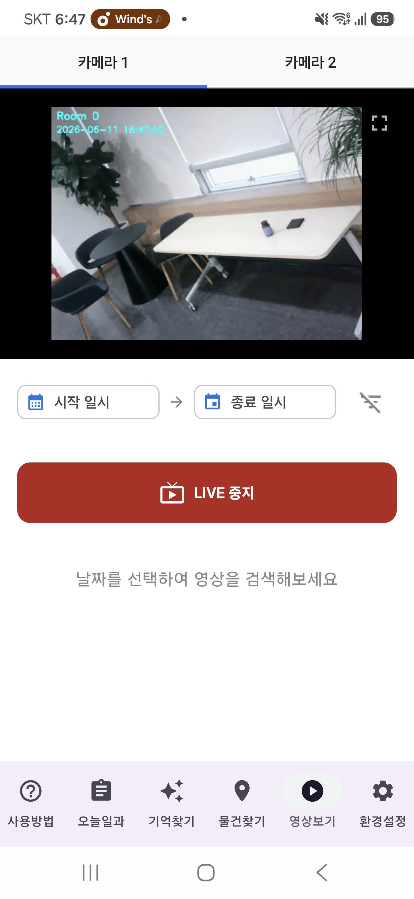</td>
    <td>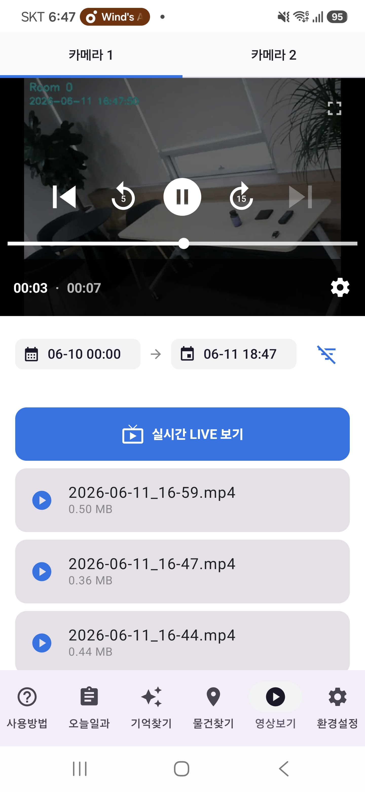</td>
  </tr>
</table>

---

### ⚙️ 핵심 적용 기술 (Android)
* **UI/UX:** Jetpack Compose를 활용한 선언형 UI 구현 및 고령자 친화적 대화면/큰 폰트 적용.
* **Network & Local DB:** Retrofit을 통한 서버 통신 및 SharedPreferences를 활용한 오프라인 환경 대응 (인터넷 끊김 시에도 알람 정상 동작).
* **Background Processing:** WorkManager를 통해 주기적으로 서버와 루틴 데이터를 백그라운드에서 동기화.

## ⚙️ 핵심 시스템 구현 상세
**1. REST API SERVER**

  

<table>
  <tr>
    <td align="center"><b>API</b></td>
    <td align="center"><b>기능</b></td>
  </tr>
  <tr>
    <td>
      auth/login
    </td>
    <td>
      • 기본적인 로그인 기능
    </td>
  </tr>
  <tr>
    <td>
      event/ edge/
    </td>
    <td>
      • 사물이 사라지거나, 특정 이벤트가 발생 관련 이벤트 
      • 수동 데이터 삽입, 이미지 비교 분석 추론 후 데이터 삽입, 현재 탐지 객체 목록 리스트 반환 구현
    </td>
  </tr>
  <tr>
    <td>
      chat/query
    </td>
    <td>
      • 챗 봇 기능 API로서 사용자의 질문 내용을 분석 
      • 과거, 현재, 논외 대화를 구분(intent)하는 알고리즘 진행 
      • intent 값에 따라 실행 코드 로직 구성
    </td>
  </tr>
  <tr>
    <td>
      routine/
    </td>
    <td>
      • 사용자의 생활 루틴 관련 이벤트 API
    </td>
  </tr>
</table>

 

**2. 녹화 영상 저장 기능**

  

* **1분 단위로 저장 됨**
* **3일 이상이 지난 영상 데이터는 자동 삭제**

**3. 시스템 프롬프트 롤 설정 및 활용 기술**
* **활용 기술:** **LM Studio**를 활용하여 로컬 환경에서 LLM을 구동하였으며, 온디바이스 및 엣지 환경에 최적화된 **Gemma (4-bit 양자화 등)** 모델과 **E2B**를 활용해 빠르고 정확한 데이터 분석 파이프라인을 구축했습니다.
* **의도 분류 (Intent Classification)**
  * **분류 목적:** 사용자의 질문을 분석하여 의도에 맞는 3가지 카테고리(`REALTIME`, `PAST`, `CHITCHAT`) 중 하나를 판별합니다.
  * **예외 처리:** 물건 찾기와 무관한 다른 대화는 거절하도록 설계했습니다.
  * **출력 규칙:** 어떠한 부연 설명이나 특수 기호 없이 오직 판별된 카테고리의 대문자 한 단어만 출력합니다.
* **상황 추론 및 분석 (Image Analysis & Inference)**
  * **분석 목적:** 전/후 사진과 이벤트 내용을 비교하여, 상황이 발생한 원인과 과정을 추론합니다.
  * **추론 원칙:** 동작의 주체는 사람으로 상정하며, 인상착의와 물건의 특징을 묘사합니다.
  * **출력 규칙:** 어떠한 부연 설명이나 특수 기호 없이 오직 판별된 카테고리의 대문자 한 단어만 출력합니다.
* **대화 및 응답 생성 (Conversation & Response)**
  * **대화 목적:** 실시간 및 과거 데이터를 종합하여 최적의 데이터를 제공하여 안내합니다.
  * **출력 규칙:** 파싱을 위해 지정된 태그 문법을 지키도록 강한 지침을 설정했습니다.
  * **문맥 제한:** 데이터를 임의로 지어내거나 단순 잡담을 하지 않도록 엄격한 규칙과 답변 예시를 안내합니다.

<table align="center">
  <tr>
    <td></td>
    <td></td>
    <td></td>
  </tr>
</table>

**4. 자동 루틴 파악 코드**

  

* **일주일에 3회 이상 같은 이벤트 발생 시 자동 루틴으로 판단, 사용자에게 루틴 등록 여부 질문**
* **만약 사용자가 거절한 루틴의 경우 데이터를 삭제하지 않고, DB에 저장하여 같은 루틴 탐지 시 질문하지 않음**

**5. DB ERD**

  

**6. 물체 이동 및 DB 업데이트**

  

* **미리 학습된 사용자의 물체가 지정된 곳에 위치하지 않으면 물건을 찾아 해당 지점으로 옮긴 뒤, 서버 DB에 동작 완료 메시지를 송신**

---

## ⚠️ 보완점 및 향후 과제
- **Pose 및 좌표 재보정**  
  LiDAR 센서를 활용해 양옆, 전후 거리를 측정하고 목표 좌표 도착 후 위치 및 각도 오차를 자동 보정하는 기능을 추가할 예정이다.

- **카메라 및 QR 코드 인식**  
  OpenCV 기반 QR 코드 인식을 통해 위치 검증 및 화물 정보를 확인하고, 인식 결과에 따라 원하는 좌표로 이동하는 로직으로 확장할 예정이다.

- **자율주행 로봇과의 통합**  
  현재는 고정된 장소에서만 로봇팔이 움직이며 물체 이동. 자율주행 로봇과 결합한 후 에고센트릭 비전 방식 등을 사용해 장소를 이동하면서도 물체를 찾고, 들어서 옮길 수 있도록 확장할 수 있다.

- **창문 역광 근본 대처**  
  창문 역광을 상태머신·증강으로 흡수했으나 검출 단계의 근본 해결은 아니다. 창문 검출 시 노출·명도를 동적 조절하거나 창문 영역(ROI)만 보정하는 방식으로 확장할 수 있다.

---

## 💁‍♂️ 팀원

| 이름 | 역할 | 담당 파트 |
|----------|----------|----------|
| 박준서 | 팀장, BE | DB, API 서버 설계 및 구축, RAG & LLM 혼합 알고리즘, LLM 프롬프트 작성 |
| 이상현 | 부팀장, FE | 안드로이드 앱 개발, LLM 시스템 구성, 이벤트 감지 설계 |
| 안해성 | Robotic Engineering | 로봇 AI 학습 및 제어, RAG 파이프라인 초기 개발  |
| 김준기 | AI Develop | 엣지 AI 파이프라인 개발, YOLO 모델 학습·경량화, 이벤트 감지 구현 |
